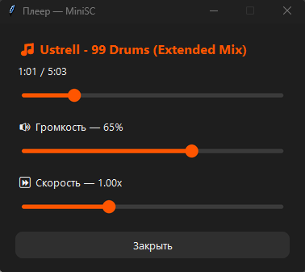
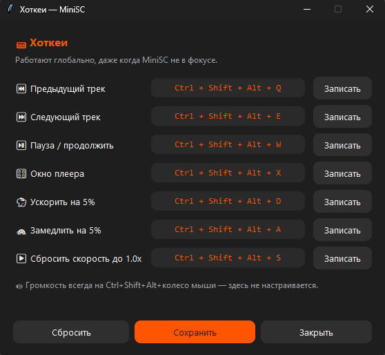
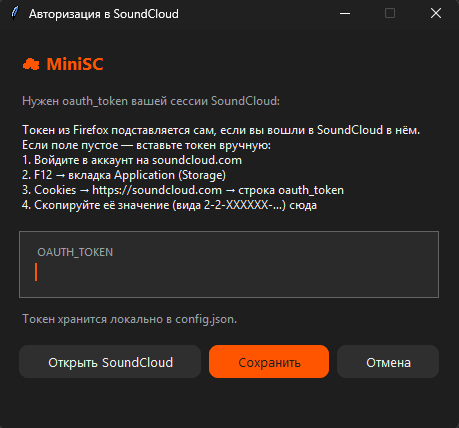

<div align="center">

# ☁️ MiniSC

<a href="LICENSE"></a>


**Мини-плеер персональной волны SoundCloud, живущий в системном трее Windows.**

Тот же интерфейс и хоткеи, что у [MiniYaMu](https://github.com/tglagcs/MiniYaMu) — только вместо «Моей
волны» Яндекс.Музыки играет бесконечная персональная лента SoundCloud.

<table>
  <tr>
    <td align="center" valign="top">
      <br>
      <sub>Окно плеера: перемотка, громкость, скорость<br>(<code>Ctrl+Shift+Alt+X</code>)</sub>
    </td>
    <td align="center" valign="top">
      <br>
      <sub>Глобальные хоткеи — настраиваются под себя</sub>
    </td>
  </tr>
  <tr>
    <td colspan="2" align="center">
      <br>
      <sub>Авторизация: токен сам подставляется из Firefox</sub>
    </td>
  </tr>
</table>

</div>

---

### Зачем это

Включаешь свою волну и сворачиваешь — без вкладки браузера, без веб-плеера
SoundCloud на панели задач (который к тому же заблокирован РКН). Play/Pause,
лайк, громкость и следующий трек — всё из иконки в трее.

> [!NOTE]
> Это неофициальный клиент, использующий внутренний API SoundCloud (`api-v2`) —
> тот же, которым работает веб-плеер. Проект не аффилирован с SoundCloud.

### Возможности

- **Бесконечная персональная волна** — аналог «Моей волны». У SoundCloud нет
  такой станции одной ссылкой (станция всегда привязана к треку-семени),
  поэтому поток собирается сам: стартовая порция — из персональных подборок
  главной, дальше очередь непрерывно дозаправляется похожими на то, что уже
  играло. Каждое прослушивание уходит в историю SoundCloud, на которой строится
  персонализация, — волна со временем подстраивается под вас.
- **Разнообразие по артистам** — «похожие» у SoundCloud тяготеют к одному
  исполнителю, поэтому волна умеет не залипать: сиды берутся от разных артистов,
  в очередь не попадает больше пары треков одного исполнителя, а подряд один и
  тот же артист не ставится. Один и тот же чел весь вечер вам не грозит.
- **Максимальное качество звука** — треки берутся в AAC 160 кбит/с (лучшее, что
  SoundCloud отдаёт бесплатно), с откатом по качеству и на прямой mp3, если
  раздача конкретного потока сорвалась.
- **Управление из трея** — Play/Pause, следующий/предыдущий трек, лайк,
  «не нравится», выход. «Предыдущий» ходит по локальной истории прослушанного —
  можно свободно вернуться назад и снова уйти вперёд. «Нравится» (❤) — локальная
  отметка (повторное нажатие снимает): в аккаунт SoundCloud лайк не уходит, его
  write-эндпоинт закрыт антиботом, зато лайкнутое подмешивается в волну. «Не
  нравится» (👎) — локальная блокировка: трек скипается и больше не попадает в
  волну на этой машине; если вернуться к нему по истории ⏮, пункт превратится в
  «↩ Вернуть в волну». Все действия сразу подтверждаются мини-плашкой снизу
  экрана (❤/💔/👎/↩/⏭/⏮) — переключение трека занимает пару секунд на загрузку, и
  без мгновенного отклика легко подумать, что нажатие не сработало.
- **Окно плеера** (`Ctrl+Shift+Alt+X` или «🎛 Плеер» в трее) — всё в одном:
  текущий трек, перемотка (`мм:сс`), громкость и скорость воспроизведения.
  Хоткей работает как переключатель — открыть/закрыть. Громкость и скорость
  сохраняются в `config.json` и восстанавливаются при следующем запуске.
- **Скорость воспроизведения** — от 0.5x до 2.0x. Питч меняется вместе со
  скоростью (как на старой кассете/пластинке при смене скорости), а не
  сохраняется независимо — так и звучит естественнее, и не нужен тяжёлый
  time-stretch.
- **Громкость колесом мыши** — зажми `Ctrl+Shift+Alt` и крути колесо где угодно
  (иконки трея Windows не отдают прокрутку сторонним приложениям, поэтому это
  глобальный хоткей, а не наведение на иконку) — ±5% за щелчок. Вместо тоста —
  мини-плашка снизу экрана с процентом и полоской, обновляется вживую и сама
  гаснет через паузу.
- **Хоткеи с клавиатуры** — глобальные, работают из любого окна:
  - `Ctrl+Shift+Alt+Q` — предыдущий трек
  - `Ctrl+Shift+Alt+E` — следующий трек
  - `Ctrl+Shift+Alt+W` — пауза / продолжить
  - `Ctrl+Shift+Alt+X` — открыть/закрыть окно плеера
  - `Ctrl+Shift+Alt+D` — ускорить на 5%
  - `Ctrl+Shift+Alt+A` — замедлить на 5%
  - `Ctrl+Shift+Alt+S` — сбросить скорость до 1.0x

  Настраиваются под себя через пункт «⌨ Хоткеи» в трее — там же кнопка записи
  новой комбинации; сохраняются в `config.json` и подхватываются сразу без
  перезапуска. Громкость колесом мыши (см. выше) туда не входит — это отдельный
  механизм (глобальный хук мыши, а не клавиатуры), поэтому комбинация
  `Ctrl+Shift+Alt+колесо` для неё фиксированная.
- **Тёмная тема** — окно авторизации, окна плеера и хоткеев, всплывающее
  меню трея. Скруглённые кнопки и слайдеры со сглаживанием (рендер через
  Pillow — сам tkinter такого не умеет).
- **Уведомления** — всплывающий тост с исполнителем и названием при смене трека.
- **Авторизация в один клик** — если вы вошли в SoundCloud в Firefox, токен
  подставляется из его куки автоматически, остаётся нажать «Сохранить».

### Авторизация и данные

При первом запуске MiniSC открывает окно авторизации. **Если вы залогинены в
SoundCloud в Firefox**, `oauth_token` в нём уже будет подставлен — просто
нажмите «Сохранить». Firefox выбран потому, что хранит куки открытым текстом; у
Chrome/Edge значение зашифровано, и надёжно достать его стало трудно. Своего
OAuth-редиректа (как Device Flow у Яндекса) у SoundCloud нет — регистрация
приложений закрыта, — поэтому берём уже готовую сессию из браузера.

Не подходит Firefox — вставьте токен вручную: `soundcloud.com` → `F12` →
**Application** → **Cookies** → `https://soundcloud.com` → строка `oauth_token`.
MiniSC не забирает куки молча: окно показывается всегда, и видно, что подставлено.

Что играется, пишется в историю прослушиваний SoundCloud (видно в профиле, на
этом же строятся рекомендации). А вот **лайки в SoundCloud не синхронизируются**:
его эндпоинт лайков закрыт антиботом DataDome, поставить лайк из стороннего
клиента нельзя. Поэтому ❤ и 👎 в MiniSC локальные — хранятся в `config.json`
(`local_likes` и `blocked`) и влияют только на волну на этой машине. При первом
запуске ваши уже проставленные на SoundCloud лайки один раз подтягиваются в ❤
(читать их можно), так что библиотека отражается сразу.

> [!IMPORTANT]
> `config.json` содержит `oauth_token` вашей сессии SoundCloud — по
> чувствительности это как пароль. Файл уже в `.gitignore`, но проверьте перед
> тем, как публиковать форк.

### Технологии

- **Python 3.14**
- **requests** — клиент внутреннего API SoundCloud (`api-v2`): лента, похожие
  треки, лайки, резолв потоков. Публичный `client_id` веб-плеера достаётся
  скрейпом главной страницы, авторизация — заголовком `OAuth <токен>`.
- **pystray** + **Pillow** — иконка и меню в трее.
- **pygame-ce** — воспроизведение аудио прямо из памяти, без временных файлов.
- **tkinter** — окна авторизации, плеера и хоткеев.
- **PyAV** — единая точка декодирования: HLS-плейлист (AAC) или прямой mp3
  декодируется в сырой PCM и играется через `pygame.mixer.Sound`/`Channel`, а
  не потоково через `mixer.music` — это и даёт перемотку с произвольной
  позиции, и скорость воспроизведения (ресемплинг с «враньём» про частоту
  даёт естественный питч, едущий вместе со скоростью).
- **ctypes + WH_MOUSE_LL / WH_KEYBOARD_LL** — глобальные низкоуровневые хуки
  мыши и клавиатуры для хоткеев громкости и управления плеером. Без сторонних
  зависимостей, только `user32.dll`.
- **sqlite3** — чтение `oauth_token` из куки Firefox (`cookies.sqlite`), без
  сторонних библиотек.

### Установка и запуск

```sh
pip install -r requirements.txt
python main.py
```

Либо запустите `run.bat` — он стартует плеер через `pythonw` (без окна консоли)
и сразу закрывается сам, оставляя работать только иконку в трее.

### Portable exe

Соберите самодостаточный exe (Python не нужен):

```sh
pip install pyinstaller
pyinstaller --noconfirm --onefile --noconsole --name MiniSC --icon icon.ico main.py
```

Готовый файл появится в `dist\MiniSC.exe` — можно закинуть куда угодно и
запускать. В отличие от запуска из исходников, exe хранит `config.json` (токен,
громкость, хоткеи, лайки, блокировки) в `%APPDATA%\MiniSC` — рядом с exe писать
нельзя (он может лежать в защищённой от записи папке).

> [!NOTE]
> MiniSC работает поверх внутреннего API SoundCloud (того же, что у веб-плеера) —
> SoundCloud может однажды поменять бэкенд, и тогда что-то придётся чинить. Ещё
> часть каталога (в основном мейджор-лейблы) отдаётся только зашифрованным
> DRM-потоком — такие треки в волну не попадают. В остальном — просто включайте
> и слушайте.

### Лицензия

[MIT](LICENSE) © 2026 tglagcs
